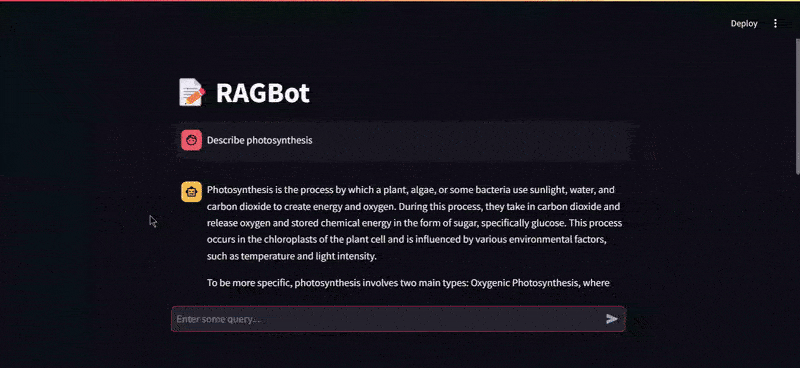

# :memo: RAGBot


RAGBot is a Retrieval-Augmented Generation (RAG) chatbot that leverages advanced AI techniques to provide accurate and context-aware responses by integrating external knowledge sources.

## Features

- **Data Retrieval**: Efficiently fetches relevant information from various sources.  
- **Preprocessing**: Cleans and structures data for optimal performance.  
- **Scraping**: Gathers data from web sources to enhance the knowledge base.  
- **Interactive Chat Interface**: Engages users in meaningful conversations.

## Prerequisites

- Python 3.8 or higher  
- Hugging Face API Token for accessing LLM

## Installation

1. **Clone the repository**:

   ```bash
   git clone https://github.com/sarbosarcar/RAGBot.git
   cd RAGBot
   ```

2. **Set up a virtual environment**:

   ```bash
   python -m venv env
   source env/bin/activate  # On Windows: env\Scripts\activate
   ```

3. **Install dependencies**:

   ```bash
   pip install -r requirements.txt
   ```

4. **Configure environment variables**:

   - Create a `.env` file in the project root.
   - Add necessary API key as required by the application.

## Usage

1. **Launch the Chatbot**:

   - Start the application using `app.py`:

     ```bash
     streamlit run app.py
     ```

   - Access the chatbot interface through the provided local server address.

## Project Structure

- `app.py`: Main application script.  
- `data.py`: Handles data operations.  
- `preprocess.py`: Data preprocessing routines.  
- `retrieval.py`: Information retrieval logic.  
- `scraper.py`: Web scraping functionalities.  
- `requirements.txt`: List of required Python packages.

## License

This project is licensed under the MIT License. See the [LICENSE](LICENSE) file for details.

## Acknowledgments

Special thanks to the LangChain and Streamlit communities for their invaluable resources and contributions.

## Contributing

We welcome contributions to enhance RAGBot. To contribute, please follow these steps:

1. **Fork the repository**:

    Click the "Fork" button at the top right corner of the repository page.

2. **Clone your fork**:

    ```bash
    git clone https://github.com/your-username/RAGBot.git
    cd RAGBot
    ```

3. **Create a new branch**:

    ```bash
    git checkout -b feature/your-feature-name
    ```

4. **Make your changes**:

    Implement your feature or bug fix.

5. **Commit your changes**:

    ```bash
    git add .
    git commit -m "Add your commit message"
    ```

6. **Push to your fork**:

    ```bash
    git push origin feature/your-feature-name
    ```

7. **Create a pull request**:

    Go to the original repository and click the "New Pull Request" button. Provide a clear description of your changes.